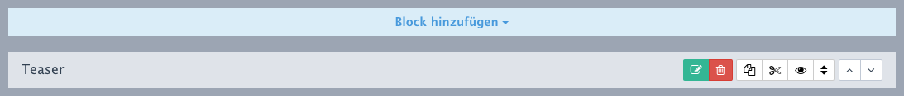
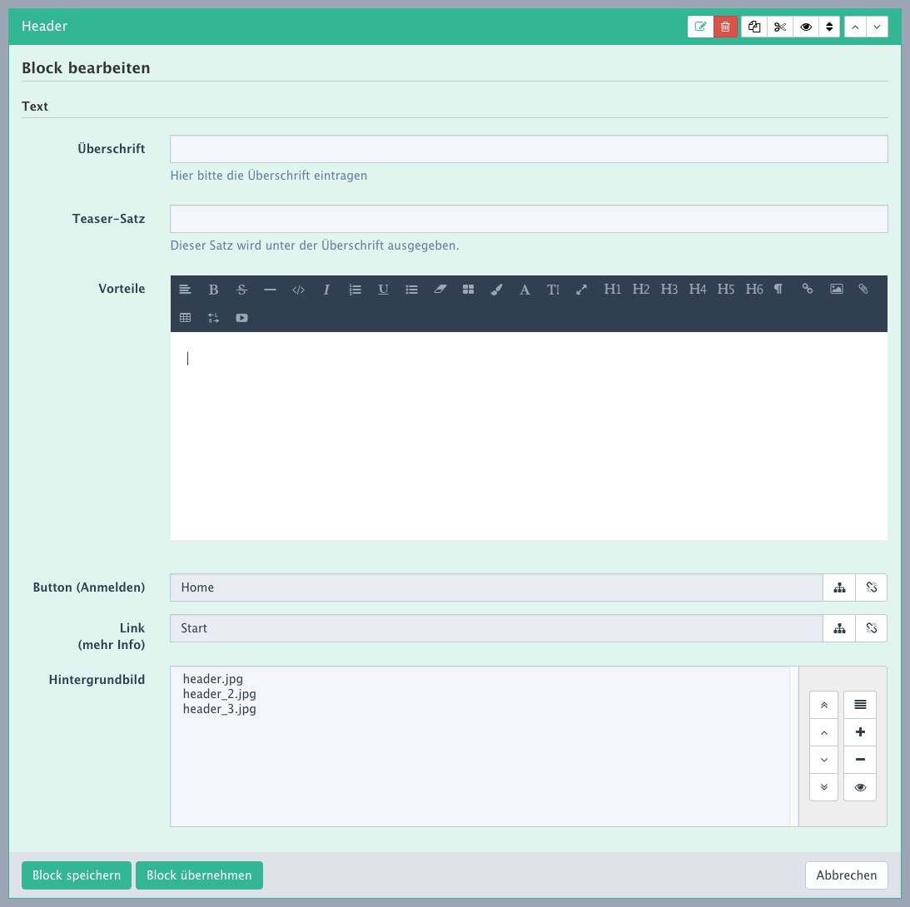

# Module / Slices

Inhaltselemente bzw. Inhaltsblöcke werden in Redaxo Module oder auch Slices genannt. Sie dienen dem Benutzer dazu, Inhalte wie Text, Richtext, Dateien und Verlinkungen zu definieren die auf der Webseite ausgegeben werden sollen. Der Aufbau kann stark variieren, da es jedem Entwickler frei gestellt ist, wie er ein Modul strukturiert. Ein Entwickler baut ein Modul im Idealfall so, dass der Benutzer später nur ein minimum an Überlegung aufbringen muss, um Inhalte zu pflegen.

>Entwickler die wissen wollen, wie ein Modul geschrieben werden muss und was für Möglichkeiten sie bieten, schauen bitte hier: [Redaxo für Entwickler | Module](http://book.redaxo.org/5.0/advanced/modules/index.html).

Für dieses Kapitel gehen wird davon aus, dass bereits ein Modul mit Eingabemöglichhkeit installiert und Verfügbar ist. Öffne nun die Struktur und öffne einen beliebigen Artikel in einer beliebigen Kategorie. Im Zweifelsfall kann auch ein neuer Artikel angelegt werden, den du später einfach wieder löscht.

## Modul anlegen

Im folgenden Bild sehen wir die Optionen die ein Modul hat. Mit `Block hinzufügen` können wir vorhandene Module hinzufügen. Hierbei ist zu beachten, dass nicht alle Seiten alle Module zulassen. Wähle nun ein Modul aus, dass du bearbeiten willst.

Wenn du ein neues Modul anlegst, öffnet sich sofort der Editier-Modus. Wenn du ein bestehendes Modul bearbeiten willst, musst du wie im oben gezeigten Bild, auf die grüne Fläche mit den Stift-Icon klicken.

Im folgenden Bild wird eine typische Eingabemaske gezeigt. Das Erscheinungsbild bzw. Design des Formular kann je nach Entwickler und Einsatzbereich variieren. Für Texte werden sogenannte `Rich Text Editoren` verwendet. Sie haben eine ähnliche Funktion wie man sie aus Programmen wie Word kennt. Die Möglichkeiten können auch hier stark beschränkt sein, damit nicht versehentlich das Design der Webseite verändert wird. Brauchst du mehr Funktionen, klär das bitte mit deinem Entwickler ab, oder editiere das Profil des RT-Editors.

Wen alles fertig ist, kannst du speichern oder übernehmen. In beiden Fällen wird das Formular gesendet und gespeichert, nur bei `speichern` wird das Modul geschlossen und bei `übernehmen` bleibt es offen um weitere Änderungen vorzunehmen.

## Weitere Optionen

Ein Modul kann auch gelöscht werden. Dazu muss man auf die rote Fläche mit dem Mülleimer-Icon klicken. Eine Prompt-Abfrage vergewissert sich dann, ob es sich nicht um Versehen handelt. Außerdem kann das Modul mit den beiden Pfeil-Icons um eins nach unten bzw. nach oben verschoben werden.

### Slice UI

Mit dem Addon Slice UI erhalten Module weitere Optionen wie Kopieren, Ausschneiden, Online/Offline schalten und Module können mit Drag&Drop verschoben werden. Mehr dazu kannst du auf Github und den Hilfeseiten lesen: [Slice UI auf Github](https://github.com/factorylabs/slice_ui).

## Module für Unterseiten ausschließen

In einigen Fällen macht es keinen Sinn, Module auf allen Seiten auszugeben. Wenn ihr zum Beispiel eine Modul-Serie für Newsletter habt, kann es Sinnvoll sein, diese nur für die Unterkategorie `Newsletter` zu aktivieren. 

Um ein Modul auszuschließen bzw. zuzulassen, musst du die Templates bearbeiten. In dem Newsletter-Beispiel müsstest du ein Template anlegen, welches du am Besten `Newsletter` nennst. Du kannst den Inhalt in einigen Fällen einfach aus dem Bestandstempalte kopieren und hier einfügen.

Unter dem Textarea des neuen Templates, können `Spalten` eingestellt werden. Klickt hier auf das Häkchen von `Alle Module verfügbar`. Es öffnet sich eine Box, in der du alle Module auswählen kannst, die in diesem Template erlaubt sind. Windows-Nutzer halten hier die Ctrl- oder Strg-Taste, Apple-Nutzer die CMD-Taste gedrückt und klicken nun alle Module an, die erlaubt sein sollen.

Speichere das Template und öffne die Struktur. Weise nun allen Artikeln dieses Template zu und du kannst in diesen Artikeln nur noch die im Template ausgewählten Module einfügen. Nutzt du das Addon Slice-UI, kannst du kopierte oder ausgeschnittene Module auch nur dort einfügen wo es die Templates zulassen.