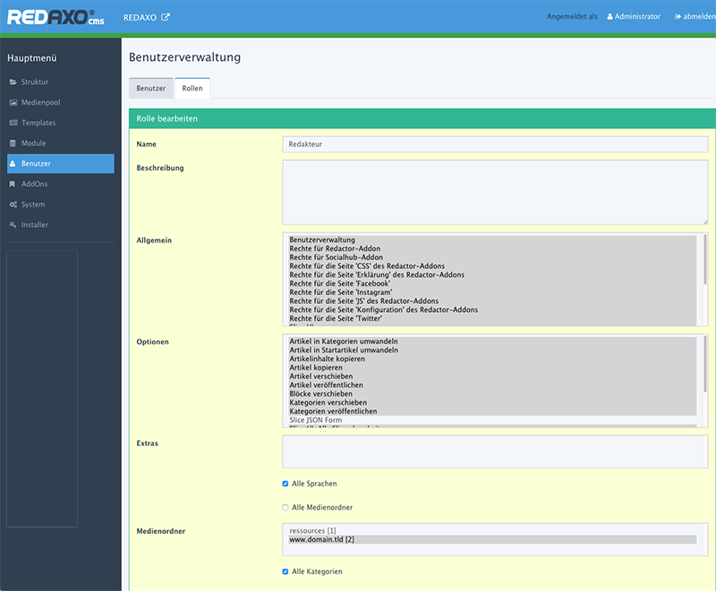

# Benutzer & Rollen

Neu in Redaxo5 ist die Möglichkeit Benutzern verschiedene Rollen zu verteilen. Eine Rolle definiert einen bestimmten Satz Berechtigungen die ein Benutzer erhalten soll. Mit dieser Technik können beliebig viele User die selben Rechte bekommen, ohne das diese Rechte für jeden Benutzer neu definiert werden müssen.

## Rollen

Viele Redakteure bzw. Benutzer benötigen lediglich einen Bruchteil der verfügbaren Berechtigungen. Im Idealfall, hat der Entwickler der Seite Redaxo entsprechend weit konfiguriert, dass der Benutzer nur noch Inhalte einlegen muss. Die Berechtigungen können unter `Benutzer -> Rollen` erstellt und editiert werden. Nachdem eine Rolle erstellt wurde, kann diese einem Benutzer zugeordnet werden.

### Allgemein

Allgemein bedeutet, der Benutzer bekommt generell Zugriff auf Addons bzw. Plugins. Es kann also sein, dass der Benutzer auf das Addon zugreifen können muss um eine Option nutzen zu können. Ein Beispiel: Ein Benutzer hat zugriff auf ein Addon und kann die Option Hilfe nutzen, aber nicht die Einstellung.

### Optionen

Einige Addons bzw. Plugins haben mehrere Optionen. Diese können in dem Feld Optionen aktiviert werden.

### Sprachen

Manche Benutzer dürfen nur auf bestimmte Sprachen zugreifen. Der Vorteil ist, dass sich diese Benutzer nicht über andere Sprachen Gedanken machen müssen, sondern lediglich über die zugeordnete. Das macht das Backend übersichtlicher und reduziert die Gefahr dass falsche Inhalte manipuliert werden.

### Medienordner

Medienordner sind Kategorien, die im Medienpool angelegt werden können.

### Module

Um das Backend für einige Benutzer noch einfacher bzw. übersichtlicher zu gestalten, kann der Zugriff auf wenige Module - oder auch Slices - beschränkt werden. Damit könnte man Benutzer, die lediglich News Pflegen können sollen, nur die News-Module freigeben.

