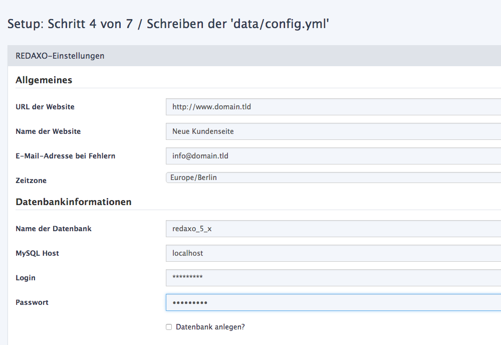
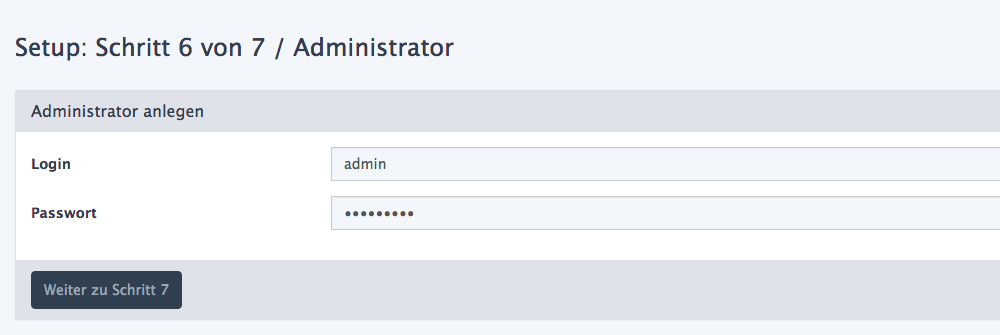

#Installation Starten

Nachdem du Redaxo auf deinen lauffähigen Server geladen hast, rufe Redaxo über deinen Browser auf. Frage notfalls bei deinem Entwickler oder Hoster an.

##Schritt 1 - Sprache wählen

Die Sprache definiert lediglich die Sprache für die Installation, bitte wähle deine Sprache aus.

##Schritt 2 - Lizenz wählen

Redaxo ist ein Open Source Projekt und kostenfrei. Allerdings gibt es Lizenzbedingungen die akzeptiert werden müssen.

###Lizenz Teil 2

##Schritt 3 - System prüfen

Redaxo prüpft bei der Installation ob die Voraussetzungen erfüllt sind. Bei einem negativen Ergebnis wirst du entsprechend darauf hingewiesen.

##Schritt 4 - Webseite einrichten

In Schritt 4 werden allgemeine Einstellungen zur Seite angegeben. Definiere hier vorab einen Passenden Titel für deine zukünftige Webseite, die URL und die Datenbankverbindung. Erfrage die Datenbankverbindungsdaten ggf. bei deinem Entwickler oder Hoster.

##Schritt 5 - Datenbank

Bitte wähle eine der drei Optionen. Die dritte Option erstellt die Datenbank direkt mit Beispielinhalten. Diese Option ist ideal um nach der Installation einen besseren Eindruck von der Handhabung im Backen zu bekommen.

##Schritt 6 - Administrator einrichten

Definiere einen Namen und ein sicheres Passwort für deine neue Installation. Sichere Passwörter haben mehr als sechs Zeichen und beinhalten Groß- wie Kleinbuchstaben und Sonderzeichen.

##Schritt 7 - Heureka

Die Installation ist erfolgreich. Bitte beachte die Hinweise auf der Seite oder melden dich direkt über den Button unter der Seite an. Alternativ kannst Du auch /redaxo/ hinter die URL im Browser schreiben, um in das Backend zu gelangen.

