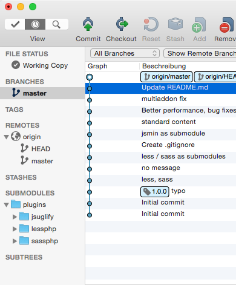

# Vendoren / Zusatztools

Um das Rad nicht neu erfinden zu müssen, können sogenannte Vendoren installiert werden. Verdorren werden in Addons und Plugins in das jeweilige `/vendors/` Verzeichnis abgelegt. Einige Vendoren können sein: [Less_Parser](http://lessphp.gpeasy.com/), [sassphp](http://leafo.github.io/scssphp/), [TCPDF](http://www.tcpdf.org/).

Alle Klassen werden von Redaxo gefunden und automatisch eingebunden, sobald diese Aufgerufen werden. Bei größeren Vendoren wie z.B. die Facebook-API, ist es ratsam *nur* die benötigten Klassen zu laden.

## Vendoren auf Github einbinden

Auf Github müssen Vendoren nicht erneut abgespeichert werden, sie können mittels `Submodules` eingebunden werden. Clients wie [SourceTree](https://www.sourcetreeapp.com/) können diese Submodule anlegen:

